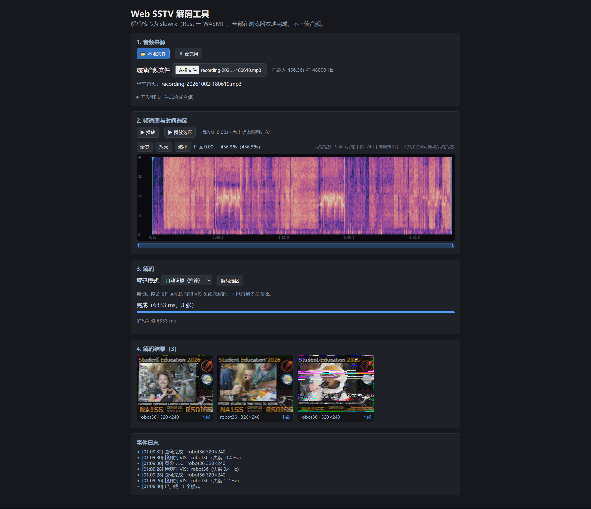

# Web 端 SSTV 解码工具


## 关于 Web_SSTV_by_slowrx.rs

Web_SSTV_by_slowrx.rs 是知名开源SSTV解码器 slowrx 的Web移植项目。
项目将纯Rust实现的 [`wty2019wty/slowrx.rs/tree/sstv-web`](https://github.com/wty2019wty/slowrx.rs/tree/sstv-web) 解码核心编译为WebAssembly，结合Web Audio API，在浏览器中完成SSTV慢扫描电视信号处理。

✨ 主要特性
- 🔒 **完全客户端运算**：数字信号处理与图像解码全部在浏览器本地完成，不会向服务器上传任何音频、图像数据。
- 📁 本地音频文件解码：支持导入本地WAV录音文件，离线解析SSTV图片。
- 📡 继承slowrx核心能力：VIS模式自动识别、频偏跟踪、自动图像倾斜校正、噪声抑制，适配业余无线电SSTV信号。
- 🖼️ Canvas渲染解码图像，接收完成后可直接下载解码后的图片。

面向短波收听者(SWL)、业余无线电HAM、SSTV信号研究人员。


---
## 预览图片



---

## 目录结构

```
.
├── Cargo.toml                 # Rust 工作区
├── rust-toolchain.toml        # 固定 Rust 1.95.0（含 wasm 目标）
├── .cargo/config.toml         # wasm32 开启 SIMD128
├── build-wasm.ps1             # 构建 wasm + 生成 JS 绑定
├── node_env.ps1               # 启用项目内置 Node（仅当前会话；见下）
├── .node-v24.19.0-win-x64/    # 便携版 Node.js 24（随项目放置，gitignore）
├── crates/slowrx/             # 内联的 slowrx 解码核心（原 fork 的 sstv-web 分支）
│   └── src/decoder.rs         # 含新增的「渐进（实时）解码」模式
├── crates/slowrx-wasm/        # slowrx 的 WebAssembly 包装 crate
│   └── src/
│       ├── core.rs            # 纯 Rust 解码封装（可原生测试）
│       └── lib.rs             # #[wasm_bindgen] 绑定层
├── scripts/smoke.cjs          # Node 冒烟测试（加载 wasm 解码合成音频）
├── img/
│   └── Web-SSTV-解码工具.png   # README 展示截图
└── web/                       # Vite + Vue 3 前端
    ├── public/
    │   └── live-capture.worklet.js     # 麦克风采集 AudioWorklet（原样拷贝）
    ├── src/
    │   ├── workers/decoder.worker.ts   # 解码 / 频谱 / 实时接收（wasm 在这里运行）
    │   ├── components/SpectrogramView.vue
    │   ├── components/WaterfallView.vue # 实时接收的滚动瀑布图
    │   ├── components/LiveImageView.vue # 实时接收的逐行图像
    │   ├── lib/{protocol,decoderClient,liveCapture,colorMap}.ts
    │   ├── wasm/              # 构建产物（gitignore，由 build-wasm.ps1 生成）
    │   └── App.vue
    └── scripts/
        ├── e2e.mjs            # 浏览器端到端测试（本机 Edge/Chrome，含实时接收）
        ├── probe-mic.mjs      # 麦克风授权探针（确认是否真的调用了 getUserMedia）
        ├── bench.mjs          # 浏览器 V8 性能基准
        └── optimize-wasm.mjs  # binaryen（wasm-opt -Oz）体积优化
```

## 环境要求

| 组件 | 版本 | 说明 |
|---|---|---|
| Rust | 1.95.0 | 由 `rust-toolchain.toml` 固定；默认 stable 未必装 wasm 目标 |
| wasm-bindgen-cli | **0.2.129** | 必须与 `wasm-bindgen` crate 版本一致 |
| Node.js | 24.x | 见 `node_env.ps1` |
| binaryen（npm） | 132.x | `build-wasm.ps1` 用它做 `wasm-opt -Oz` 体积优化（`web` 的 devDependency） |
| wasm32-unknown-unknown | — | 已随工具链配置声明 |

安装 wasm-bindgen-cli：

```powershell
cargo install wasm-bindgen-cli --version 0.2.129 --locked
```

## 构建与运行

```powershell
# 0) 启用项目内置 Node（每个新终端都要先执行一次，否则可能提示找不到 npm）
. .\node_env.ps1

# 1) 构建 wasm 并生成前端绑定（-Dev 启用合成测试音频）
.\build-wasm.ps1 -Dev

# 2) 安装前端依赖（只需一次）
npm run install:web

# 3) 启动开发服务器（根目录或 web/ 均可）
npm run dev
```

打开 <http://127.0.0.1:5173/>，选择模式后点“生成合成音频”，在频谱图上拖拽选区后点“解码选区”，
或“选择音频文件”载入本地录音；在「1. 音频来源」切到「🎙 麦克风」再点「开始接收」即可实时
逐行接收（需 HTTPS/localhost）。

> ⚠ **麦克风实时解码目前是实验功能（开发测试阶段）**：实时链路的同步 / 识模 / 抗噪仍在调优，
> 出图可能错位、缺行甚至整段失败，界面上有明确的「实验功能 · 开发测试阶段」标注。
> 需要可靠结果时，请用「📁 本地文件」走离线解码。

> 根目录的 `package.json` 只是脚本入口（`npm run dev` / `build` / `e2e` / `wasm` 等会委托到
> `web/`）。前端项目本体在 `web/`，也可以 `cd web` 后直接用 `npm run dev`。

> `slowrx` 解码核心已**内联**到 `crates/slowrx`（原 fork 的 `sstv-web` 分支，含强制模式 /
> 解码窗口 `#113`/`#114`）。内联是为了加入「渐进（实时）解码」模式；不再需要构建时
> 访问 GitHub。若要与上游 fork 同步，需手动合并 `crates/slowrx`。

## 部署（GitHub Pages）

推送到 `main` 或 `page` 分支（也可在 Actions 页面手动触发）会运行
`.github/workflows/deploy-pages.yml`：在 Ubuntu runner 上执行
`cargo build → wasm-bindgen → npm ci → vite build`，并把 `web/dist` 发布到
GitHub Pages。

站点地址：<https://wty2019wty.github.io/Web_SSTV_by_slowrx.rs/>

首次使用需在仓库 **Settings → Pages** 里把 **Source** 设为 **GitHub Actions**。
工作流由 GitHub 注入的 `GITHUB_REPOSITORY` 自动推导 Vite 的 `base`
（`/Web_SSTV_by_slowrx.rs/`），本地开发仍回退到根路径；如部署到别处可用
`VITE_BASE` 覆盖。若从非默认分支（如 `page`）部署，请在
**Settings → Environments → github-pages** 的部署分支策略中放行该分支。

## 验证

```powershell
# Rust 单元测试（原生，覆盖自动识模 / 强制模式 / 静音门限 / 模式列表 / 渐进解码）
cargo test -p slowrx-wasm

# 内联解码核心的完整测试（含各模式合成 round-trip、多图、强制模式）
cargo test -p slowrx --features test-support

# Node 冒烟测试：直接加载 wasm 解码合成音频并写出 out/pd120.ppm
.\build-wasm.ps1 -Node -Dev
node scripts\smoke.cjs

# 浏览器端到端：Vite + 本机 Edge/Chrome，Worker 内解码后断言 Canvas 出图
cd web
npm run e2e

# 麦克风授权探针：确认「开始接收」是否真的调用了 getUserMedia（含拒绝 / 已授权两条路径）
npm run probe:mic
$env:PROBE_FAKE_UI='1'; npm run probe:mic

# 浏览器 V8 性能基准：全部模式合成音频的解码耗时
npm run bench
```

构建脚本会在 wasm-bindgen 之后自动用 binaryen 做 `wasm-opt -Oz` 体积优化
（`build-wasm.ps1 -NoOpt` 可跳过）。体积对比：

| 产物 | 大小 |
|---|---|
| 优化前（wasm-bindgen 输出，dev-synth） | 1055 KB |
| + `panic=abort` / `strip` | 970 KB |
| + `wasm-opt -Oz` | **683 KB**（dev-synth） / **669 KB**（生产，gzip 193 KB） |

### 浏览器 V8 实测（无头 Edge，wasm SIMD128，仅解码循环）

2026-10 两轮实测取均值（模式清单与图像时长取自 wasm `listModes()`，与 Rust 模式表同源）：

| 模式 | 分辨率 | 图像时长 | 解码耗时 | 倍速 | 早前 wasmtime(Cranelift) 基线 |
|---|---|---|---|---|---|
| PD-50 | 320×256 | 49.7 s | 3.13 s | ≈16× | — |
| PD-90 | 320×256 | 90.0 s | 4.30 s | ≈21× | — |
| PD-120 | 640×496 | 126.1 s | 6.76 s | ≈19× | 5.77 s |
| PD-160 | 512×400 | 160.9 s | 7.46 s | ≈22× | — |
| PD-180 | 640×496 | 187.1 s | 8.42 s | ≈22× | 7.53 s |
| PD-240 | 640×496 | 248.0 s | 10.99 s | ≈23× | 9.25 s |
| PD-290 | 800×616 | 288.7 s | 12.23 s | ≈24× | — |
| Robot 24 | 320×240 | 36.0 s | 2.46 s | ≈15× | — |
| Robot 36 | 320×240 | 36.0 s | 2.25 s | ≈16× | ~2–3 s |
| Robot 72 | 320×240 | 72.0 s | 4.06 s | ≈18× | — |
| Scottie 1 | 320×256 | 109.7 s | 5.41 s | ≈20× | — |
| Scottie 2 | 320×256 | 71.1 s | 4.38 s | ≈16× | — |
| Scottie DX | 320×256 | 268.9 s | 10.61 s | ≈25× | — |
| Martin 1 | 320×256 | 114.3 s | 5.62 s | ≈20× | — |
| Martin 2 | 320×256 | 58.1 s | 3.91 s | ≈15× | — |
| Wraase SC2-180 | 320×256 | 182.0 s | 7.59 s | ≈24× | — |

结论：

- **解码耗时主要正比于图像标称时长，与分辨率基本无关**：PD-290（800×616，49.3 万像素）
  与 PD-160（512×400，20.5 万像素）的耗时比几乎就是 288.7 s : 160.9 s；Robot 24 与
  Robot 36 的图像时长同为 36 s，耗时也几乎相同（2.46 s / 2.25 s）。
- 全部 16 个模式约 **15–25 倍实时**（解码耗时 = 图像时长的 0.04–0.07）。短模式的固定开销
  （每通道 FFT 边缘余量、sync 搜索）占比更高，倍速略低；长模式趋近上限。
- 绝对值随机器状态/浏览器版本波动约 ±10%（个别模式 ±15%）；与早前测得的
  wasmtime(Cranelift) 基线同量级、本轮略高 10–19%，跨环境比较仅供量级参考。
  方案文档中“wasm SIMD 约 2.5–2.6× native”的预期在浏览器端量级得到确认；
  `PIXEL_FFT_STRIDE` 无需调整。

## 里程碑状态

- [x] **M2** `slowrx-wasm` 包装 crate + Worker：Worker 内解码一张合成分片出图
- [x] **M3** 音频输入：文件（`decodeAudioData` → 单声道 f32）与合成音频；解码统一在
  Worker 内处理，**末尾补 2 s 静音**（方案 4.3）
- [x] **M4** 强制模式路径：**直接用播放头位置当锚点**（在频谱图上点击/拖拽或用播放定位），
  由「起点 / 终点」二选一决定该位置的语义（`starting_at` / `ending_at`）；不使用范围选区，
  从锚点喂到文件末尾，长度由模式标称时长决定
- [x] **M5** 频谱图 + 时间选区：Worker 内用 wasm 的 rustfft 算 STFT，主线程双层 Canvas
  渲染，支持缩放/平移（滚轮 + **横向滚动条**）与选区创建/移动/两端缩放
- [x] **M6** 结果渲染 + 逐张 PNG 下载 + 状态/进度；**默认自动识模**（一次可解出多张，
  结果画廊展示）；音频播放（整段 / 选区）、播放头同步、点击频谱图定位
- [x] **M7** V8 性能收尾：浏览器实测各模式耗时（与 wasmtime(Cranelift) 同量级）；`panic=abort`+`strip`
  + binaryen `wasm-opt -Oz` 把 wasm 从 1055 KB 压到 **683 KB（-35%）**；`PIXEL_FFT_STRIDE`
  无需调整
- [x] **M8** 实时接收（麦克风）：`getUserMedia` → `AudioWorklet`（已关闭回声消除/降噪/
  自动增益）→ Worker 内**常驻解码器**（自动识模）+ **流式 STFT 瀑布图** + **逐行实时图像**；
  采集/接收的 PCM 全部在本机内存中，不上传
- [x] **M9** 渐进（实时）解码：内联 slowrx 核心并新增渐进模式——检测到 VIS 后约 1–2 行
  内锁定同步，之后**每收够一行就解一行**（`line` 事件）逐行绘制；整图末尾用**完整 sync
  轨道重解一次**，保证最终图与离线批处理**逐像素一致**。首图延迟≈1–2 行，且解码 CPU
  摊到整段接收时间上
- [x] **M10** 实时质量工具：**输入诊断面板**（实际生效的采样率/声道/回声消除/降噪/AGC +
  实时峰值/RMS/削波/动态范围）、**实时录音**（停止后一键用**离线文件路径**重解，作同源
  权威结果）、**停止收尾精修**（中途停止时用完整 sync 重解已收行，产出标记「未完整」的图）

## 设计要点

- 离线/文件解码仍是“两遍式”（缓冲约一整张图后爆发式计算），故选区解码的进度为估算；
  实时接收改用渐进模式逐行解码（见下），不在此列。解码必须放 Web Worker（方案 4.1）。
- 强制模式必须携带解码窗口；WS 自动识模与强制模式两条路径在 UI 上可切换。
- wasm 目标依赖 `rustfft/wasm_simd` + `-C target-feature=+simd128`，实测有效。
- 音频用 `postMessage` + transferable 传递，不引入 SharedArrayBuffer。
- 播放：Worker 在载入完成后回传一份 PCM 副本，主线程用 Web Audio API
  (`AudioBufferSourceNode`) 播放；播放头由 `AudioContext.currentTime` 驱动并绘制在
  频谱图上，移出视口时自动跟随。
- 会话模型：Worker 持有当前 PCM，频谱图与选区解码都引用它，避免重复搬运大数组。
- 两条解码路径（方案 6.5）：
  - **自动识模（默认）**：只喂入选区切片 + 末尾静音，按选区内的 VIS 头依次解码，
    可能一次得到多张图；结果以画廊展示、逐张下载；
  - **强制模式**：**直接用播放头位置当锚点**（点击/拖拽频谱图或用播放定位），由
    「起点 / 终点」决定语义（`starting_at` / `ending_at`），不显示范围选区；从锚点喂到
    文件末尾 + 末尾静音，长度由模式标称时长决定。锚点处若有 VIS 头会**自动按测得的
    失谐修正**解调频带；没有 VIS 头时可用界面上的「失谐兜底」填入电台失谐（Hz，可正可负）
    来补偿。
- 频谱图为 8 位强度矩阵（列优先），绝对 dBFS 参考归一化 + 伽马校正，传输/内存开销小。
- 体积：`panic=abort` + `strip` + binaryen `wasm-opt -Oz` 后生产版约 **669 KB**
  （gzip 193 KB），dev-synth 版约 683 KB；`build-wasm.ps1 -NoOpt` 可跳过优化。
- 性能：全部 16 个模式约 **15–25 倍实时**（SIMD128），解码耗时主要正比于图像标称
  时长、与分辨率基本无关（PD120≈6.8 s、PD180≈8.4 s、PD240≈11.0 s）。详见上面的基准表。
- 实时接收（渐进解码）：内联的 slowrx 核心新增**渐进模式**（`SstvDecoder::set_progressive`，
  WASM 侧 `WasmDecoder.setProgressive`）。检测到 VIS 后约 1–2 行即可从 sync 下降沿锁定
  `skip` 并开始逐行解码；`rate` 的斜率修正等约 8 行、Hough 可靠后再采用，之后每 8 行用
  更多 sync 重估一次（只影响未解码的行）。整图收完后**用整段 sync 重跑 `find_sync` 并整图
  重解**，因此 `ImageComplete` 与离线批处理逐像素一致（原生单测 `progressive_streams_lines_and_matches_batch`
  覆盖）。逐行解码把 CPU 摊到整段接收时间上，不再有整图突发卡顿。
- 实时瀑布图由 wasm 侧新增的**流式 STFT**（`StreamingSpectrogram`，复用 rustfft）
  增量输出新列，与离线频谱图使用同一套加窗/归一化（有单元测试保证逐字节一致）；
  主线程用离屏画布自滚动渲染，1 列 = 1 像素。逐行实时图像用 `putImageData` 脏矩形
  只刷新一行；整图末尾的重解发来同样的行，尺寸不变时不重画，避免闪烁。
- 实时质量诊断：`getUserMedia` 的约束可能被浏览器/驱动覆盖（尤其 AGC），因此面板显示
  `track.getSettings()` 的**实际生效值**，并统计实时峰值/RMS/削波/动态范围——用于区分
  「拾音链路问题」与「解码问题」。
- 实时录音 + 离线重解：接收的同时把 PCM 录在本地（上限 5 分钟），停止后可一键载入文件
  解码路径重解，得到同源的权威结果（也便于用同一段音频对比实时与离线）。
- 停止收尾：`SstvDecoder::finalize()` 用已收集的完整 sync 重解已到齐的行，产出一张
  `partial: true` 的图（UI 标记「未完整」），避免中途停止只剩未经精修的预览。
